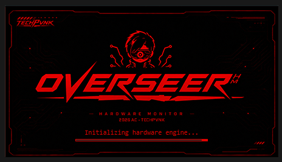
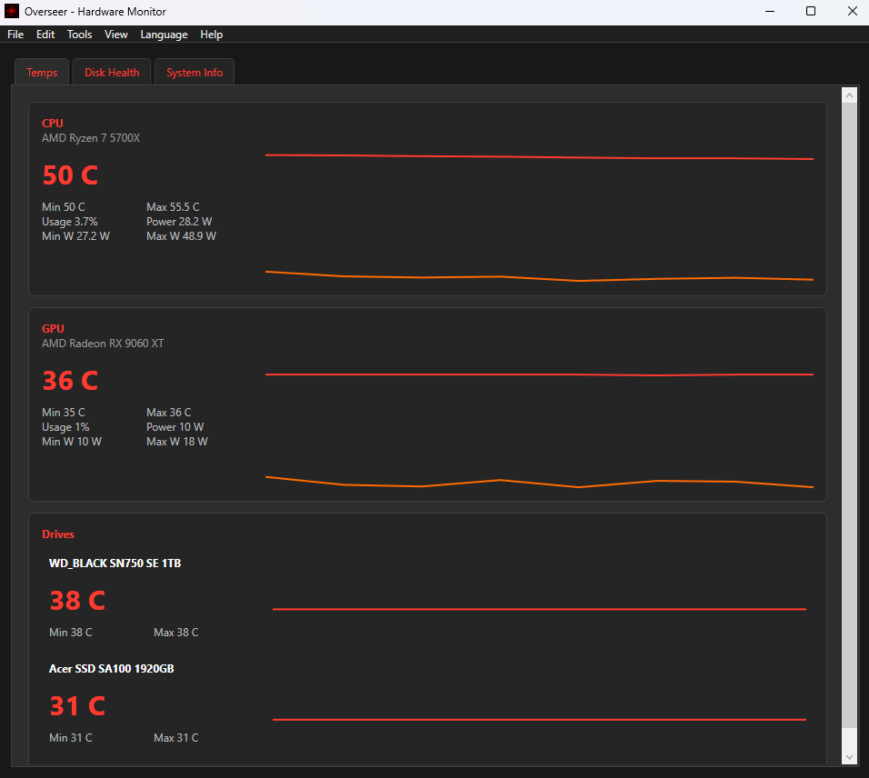
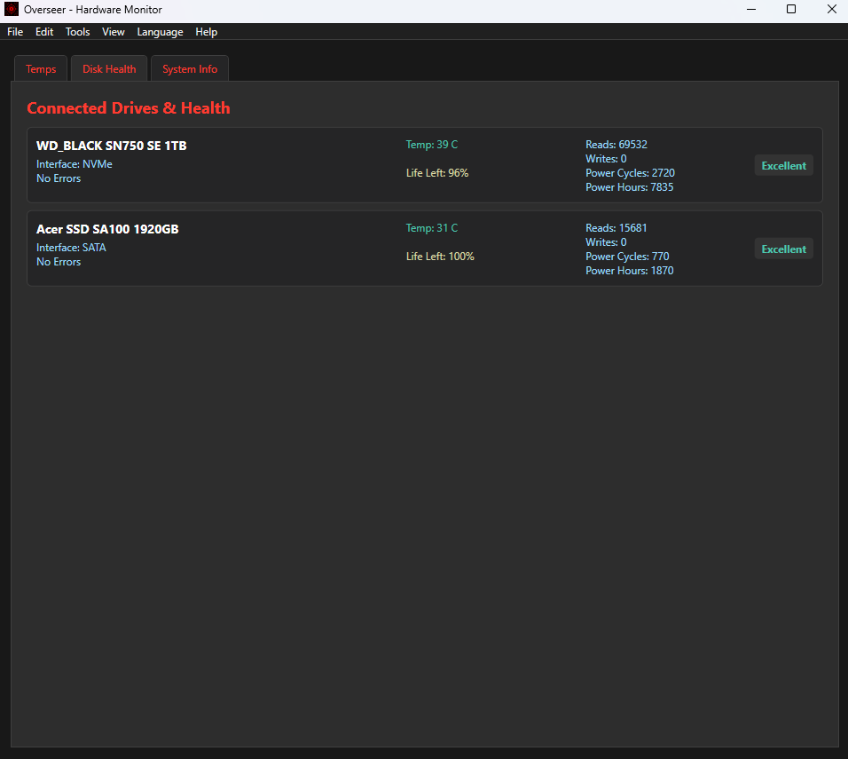
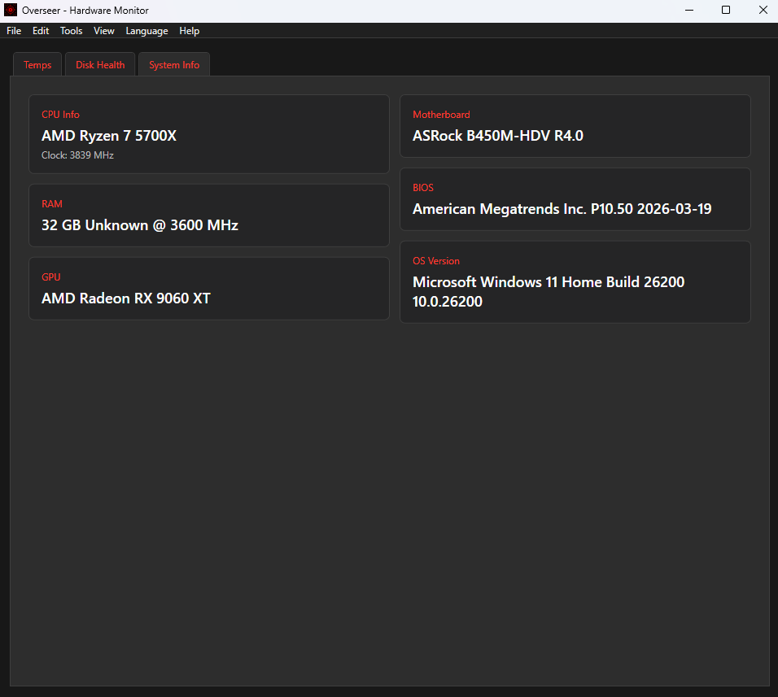

Overseer - Hardware Monitor (WPF)
=================================

Overseer is an extremely straightforward Windows desktop hardware monitoring application built with WPF and .NET 8. It reads system sensors (CPU/GPU temps, usage, disk health, etc.) and provides export, AOT and tray features.

## Why use OverseerHM?

Because you get fast and simple, super lightweight, no-nonsense HWMonitor, Crystaldiskinfo, and CPU-Z capabilities in one app w/ three tabs.

## Temps Monitoring

- CPU/GPU current temps with min/max temps, power, and usage
- Drives connected with min/max temps

## DrivesTab

- Drives connected with model name and SMART data including temps, writes, reads, power hours, error list of present, health, and a status badge based on drive's data.

## System Info

-Simple System info view including CPU name, MoBo name, GPU name, BIOS version, Ram capacity+set speed, OS version.

## More on Overseer

Overseer is focused on delivering real-time system information through a clean, immersive modern interface.

Rather than overwhelming users with endless tables of sensors, Overseer aims to make monitoring your PC both effortlessly informative and enjoyable, but most of all, straightforward. The core emphasis is both usability and performance.

I recondition and resell laptops. This app was born because I got tired of installing and using different monitoring apps each time I had to diagnose PCs. 
It was a waste of time to install, run and then navigate into those apps for different readings when I already knew what I wanted to see while also knowing this could all be monitored in a single view.

So I hope it's of help for you too. Yes, this is heavily ai assisted coding, and I'm so grateful technology now ables me do things like this. I do know basic coding, and plus it works. Enjoy.

There's still much to do but I decided not to be a perfectionist and just iterate along the way!

-----

✨ Features
📊 Real-time CPU, GPU and disk monitoring
🌡️ Temperature, utilization and power sensors
📈 Interactive performance graphs
🎨 Modern cyberpunk-inspired interface
⚡ Lightweight and responsive
🖥️ Built with WPF and .NET
🔌 Extensible architecture for future plugins
🌙 Customizable themes (planned)

-----

🤝 Contributing

Contributions are welcome!

Whether you'd like to:

fix bugs
improve performance
add hardware support
improve the UI
translate the application
improve documentation

feel free to open an Issue or submit a Pull Request.

Please discuss major changes before beginning implementation.

-----

🎨 Branding

The Overseer name, TechPvnk branding, logos, artwork, icons, mascot, and other visual assets are not covered by the MPL 2.0 unless explicitly stated.

These assets remain Copyright © 2026 Alfredo Capella. All rights reserved.

-----

❤️ Support the Project

If you enjoy Overseer and would like to support its development, consider:

⭐ Starring this repository
🐛 Reporting bugs
💡 Suggesting new features
🤝 Contributing code
☕ Supporting development via Ko-fi https://ko-fi.com/techpvnk

Every contribution—large or small—helps make Overseer better.

🌐 About

Overseer is developed by TechPvnk, a project dedicated to giving technology a second life through restoration, repair, open-source software, and a passion for PC hardware.
If you enjoy restoring, tinkering, Linux, hardware modding, and building unique tools, you're in the right place.

Check my content here:
https://www.youtube.com/@TechPvnk
https://www.instagram.com/techpvnk_/
https://www.tiktok.com/@techpvnk_
https://x.com/TechPvnk 

Status
------
- Project targets: .NET 8 (net8.0-windows)
- Uses the LibreHardwareMonitor NuGet package for sensor readings

Requirements
------------
- Windows 10/11
- PawnIO (bundled)
- Librehardware package (bundled)

License
-------
This project is licensed under the MPL 2.0 License. See LICENSE for details.

Author
------
Alfredo Capella (TechPvnk)

Contact
-------
techpvnk@proton.me

V 0.1:
- Some menu functions missing:
	-Language (English for now)
	-Help links (only About works)
	-Open Log

Coming Soon:
- All of that plus:
	-Sidebar
	-Themes
	-An actual website I guess
